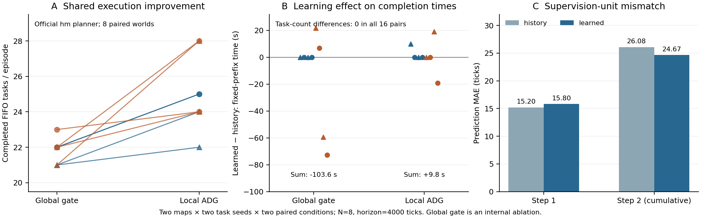

# R8 配对结果图

A：八个同输入world中，作者hm规划器在同样两步承诺缓冲下的global/local任务数；蓝色为空图，橙色为随机障碍图，圆点为nominal，三角为axis。相同地图/任务种子下的两个条件相关，不将八条线当八个完全独立样本。全队附加门为内部消融。

B：每个world中学习模型相对同历史规则的固定每机器人前10项FIFO受限完成时间差，负数为学习更好。所有16个配对完成任务数相同；global总差−103.6秒，local总差+9.8秒。未完成的固定任务按400秒截尾，指标不采用由策略决定的任务揭示分母。

C：事后在完全相同的local-hm事件上评估两预测器。第1步MAE为15.20/15.80ticks，第2步累计标签为26.08/24.67ticks。第2步以batch起点计时，混入了前一步时长，与单步训练单位不一致；图中下降不能解释为有效单步误差学习。该诊断未用于修改本轮模型、预算或留出策略。

数据源：`ROOT_EXECUTION_AUDIT.json`（root独立重建原ADG前驱ACK、FIFO和任务时刻）、`label_shift.json`（事后监督单位诊断）。`plot_root_results.py`可重建SVG/PDF/PNG；图中无基于伪独立样本的误差条。
