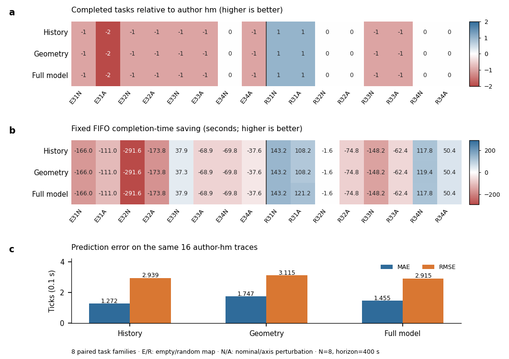

# R10 全条件归因图

八个独立 map/task family，各配对 nominal/axis 两种执行扰动，共16条件×4策略。N=8，固定400秒窗口。a：三种内部模型/规则相对作者 hm 接口的任务差；b：相对 hm 的固定前10 FIFO 完工时间和节省，未完成项按窗口终点计，原始ticks按0.1秒换算；两个面板均以正数为改善。E/R 表示 empty-32-32 与 random-32-32-10，31–34 是 seed 的末两位，N/A 表示 nominal/axis。

c：在同一组16条 hm 原始轨迹上计算的 motion primitive MAE/RMSE，单位ticks。完整模型的MAE高于历史规则，而RMSE略低，预测准确度和闭环任务结果分别报告。图中没有从64臂中筛选有利条件，64臂不当作64个独立样本。各策略总任务371/363/363/363，预测组别仅为后三种内部消融。

图源为 `geometry_history_20261003_r10/summary.json` 与 `prediction_same_hm_traces.json`，哈希见 `FIGURE_MANIFEST.json`；数据均来自实际运行，不含模拟补点或平滑。SVG为可编辑文本，PDF嵌入TrueType，PNG为600dpi；预览另存。此图未纳入随后提出、使用新场景的 residual 探索。
