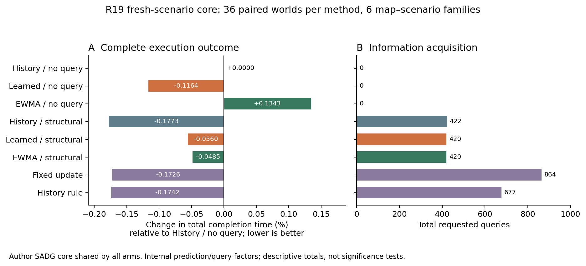

# R19：真实费用反馈、条件时长学习与结构查询

2026-10-05。本轮已完成三线实作：主线让第一次真实费用回执进入非空后继决策并完成第二次付费执行；学习线从既有 TRAIN 训练条件时长模型，冻结后进入新场景；执行线完成342条登记记录，其中324条完整执行、18条初始规划失败保留。没有重跑 R18 科学矩阵，也没有按本轮 TEST 结果改模型或阈值。

导师判断是：三条线继续推进，但共同服务于一个问题——**有延迟、有成本的执行信息，何时能改变仍可合法调整的计划并改善任务完成？** 当前最清楚的查询收益来自结构选择；学习已能改变合法排序并产生任务收益，但“学习＋查询”尚未形成稳定的组合优势。方法下一步见 [NEXT_METHOD_PLAN.md](NEXT_METHOD_PLAN.md)，事前设计见 [THREE_ROUTE_DECISION.md](THREE_ROUTE_DECISION.md)。

## 1. 主线：费用回执已进入下一次真实决策

本机 `implementation_binding_evidence/successor_cost_feedback_20261005_r19/` 保存实现、原始命令与报告；公共 main 只发布四份进度文档。第一次查询的真实费用为16,323,730，原 RoundRobin 在同一非空候选上读取此费用与剩余预算，分别走 BUY、WAIT、预算不足分支。BUY 的第二次查询经历真实 REQUEST、POSITION、提交、原 guard、RUN、普通 END、FIFO 服务、费用回执与清理。三个最终 Natural 运行均完成四任务，服务时刻和为72、74、74。

第二次查询实际费用277,926,850，是上次回执报价的17.02594倍；报价低估261,603,120。BUY 总实际工作1,590,184,009，WAIT为1,317,386,247，总工作差272,797,762不能当作第二次查询费用。它暴露了有研究价值的成本预测失配，并未建立硬预算保证。当前仍是有限供给脚本和原 RoundRobin，不能称自适应价值调度器或长期吞吐提升。独立根复算6,109项通过；范围是来源、费用、分支、实际任务与清理，不声称重新推导了连续几何证书。

下一优先：让费用预测条件化于当前任务/证据规模，并把候选在观测送达前失效的可能性纳入购买价值。运动时长标签与计算费用标签分别建模。

## 2. 学习线：冻结模型已在新场景实际部署

[训练与模型报告](https://github.com/LYHrmer/MAPF_PIED_MDDR_RESEARCH/blob/explore/learned-query/exploration/learned_query/conditional_duration_20261005_r19/REPORT.md)给出8个公共特征的 lognormal AFT/ridge 模型。训练仅复用54条 R18 TRAIN 历史轨迹、51,942个已完成动作和6,477个活动时刻标签；不把依赖等待计入动作执行时长。模型预测 START 总时长，以及条件于“到当前仍未 END”的剩余时长。运行时不读取私有扰动、未来 END 或世界身份。

核心新场景中，learned/no-query 相对 history/no-query 为4优、2劣、30平，总完成时间少74.166667；相对 EWMA/no-query 为4优、1劣、31平，少159.75。它确实影响排序和完整执行，不能再概括为“模型没有实际作用”。但幅度小且地图×场景族只有6个：相对历史的族均差为−0.05981%，探索性95%区间跨0。N64只有2个可执行族，单独报告。

[事后登记的共同轨迹预测诊断](https://github.com/LYHrmer/MAPF_PIED_MDDR_RESEARCH/blob/explore/learned-query/exploration/learned_query/conditional_duration_20261005_r19/heldout_r19/REPORT.md)在相同 history/no-query 状态上比较9个冻结模式。核心 START MSE：learned 0.346998、EWMA 0.362021；活动剩余时长 MSE：learned 0.457975、EWMA-survival 0.445077，学习反而较差；START MAE也不占优。这项诊断不重训、不调用求解器、不追加物理执行。66,801个 START 与7,879个活动标签的全部672,120个预测经过独立复算。

下一优先：联合建模整段动作年龄、带捕获时间的位置观测和暂停/变速状态，保留强经验生存/EWMA 对照。当前所有训练 nominal duration=1，不能声称已学会任意长度几何的尺度迁移。暂不以更大网络替代条件定义与决策价值设计。

## 3. 作者执行底座：结构查询取得明确的节省信号

初始路径沿用作者 ECBS，原 SADG 优化器固定在 `c2626d996121a9d6c128844a167b917db24418ac`。新增适配器、预测器和查询器分开保存，未修改作者优化核心。SADG 是 [T-RO 论文及作者工件](https://arxiv.org/abs/2312.04190)；表内8种方式是共享其核心的内部因子，不是8个已发表外部算法。

新场景为 random、maze、warehouse 三张标准地图，场景6/7，N16/32，stable、bounded_pause、speed_shift，共36配对世界×8方法。N64扩展为9登记世界×6方法，maze场景6初始 ECBS 在原30秒限制内超时，因此留下18条失败记录；其余6世界×6方法完成。初始规划不补抽、不加时重试。查询延迟0.25，预算N，触发频率、作者 horizon 和三类扰动事前冻结。全部方法完成既定轨迹；本轮是固定路径执行实验，不冒称 lifelong 任务吞吐实验。

| 核心方法 | 完整执行 | 完成时间总和 | 查询次数 |
|---|---:|---:|---:|
| History / no query | 36/36 | 63732.083333 | 0 |
| Learned / no query | 36/36 | 63657.916667 | 0 |
| EWMA / no query | 36/36 | 63817.666667 | 0 |
| History / structural | 36/36 | 63619.083333 | 422 |
| Learned / structural | 36/36 | 63696.416667 | 420 |
| EWMA / structural | 36/36 | 63701.166667 | 420 |
| Fixed update | 36/36 | 63622.083333 | 864 |
| History rule | 36/36 | 63621.083333 | 677 |

结构查询相对同预测器 history rule：查询677→422，减少37.67%，完成时间总和少2，配对1优/0劣/35平。相对固定更新，查询864→422，减少51.16%，时间总和少3。这是本轮最清楚的查询效率信号，但绝对完成时间增益很小，不能只报百分比省查询而隐藏大量相同轨迹。

组合并非自动有效：learned/structural 比 learned/no-query 多38.5完成时间、购买420次查询；相比 history/structural 多77.333333完成时间。当前 POSITION 送达后统一使用原历史线性残差，会覆盖条件时长估计；此外作者 horizon 用整段期望时长判定。因此差异包含信息融合与候选可见性变化，不应全归为预测准确率。

全量及N64表见 [RESULT_TABLES.md](RESULT_TABLES.md)。图用合并总和的百分比，族均区间见分析表，两种统计量不混用。3地图工作进程并行、每地图方法串行；墙钟耗时不作为干净的算法速度比较。

## 4. 机制、失败与独立核验

324条完整执行通过不导入引擎或预测器的独立审核，共221,381,042项检查；覆盖原始事件、公共历史、条件预测、查询捕获/送达、采用图、资源/几何和完成时间。审核复用已完成证明，不重复科学执行。8种篡改负例被拒绝；另在迁移目录验证67,294项通过。详 [INDEPENDENT_AUDIT.json](INDEPENDENT_AUDIT.json) 与归档中的 `review/`。

原始优化接口有135条拒绝记录、77个独特失败输入，涉及23个 maze s06 N32 episode；77次是原始调用、58次是完全相同输入的负缓存。作者接口虽返回 OPTIMAL，独立 Decimal 复算仍发现完整模型行约束违反，123条明显≥0.001，12条接近1e-5固定容差；全部保持原父图继续执行。变量命名、边界、整数性与残差均复核，尚未定位 CBC/Python-MIP 的具体根因。见 [全量失败诊断](solver_failure_review/FINAL_FAILURE_REVIEW.md)。

294组机制对比中65组改变物理事件时刻、55组改变完成时间和；首次方向变化合法且先于物理差异。55个非零对比的首次物理差异前均无拒绝，说明实际分叉并非都由失败制造；其中12组后期有拒绝，最终增益幅度仍受回退影响。两例及全量正负结果见 [机制复核](mechanism_review/FINAL_MECHANISM_REVIEW.md)。

## 5. 科研导师后评审与下一步

**主线继续完成可计价的信息闭环；学习线继续做条件预测和价值学习；第三线提供可信作者基线与完整任务结果。** 三者当前适合组成一条论文证据链。现有数据支持继续投入，不足以把“加模型”本身写成创新点，也还不能承诺二区/三区录用。

具体顺序是：先对齐带时间戳的 POSITION 与条件残差，提出合法候选会过期的查询价值；并行用已有真实费用回执建立按问题规模变化的费用估计。随后在未使用场景/扰动强度上检验完整完成时间—查询—计算代价曲线。已观察的 R19 数据只作开发/诊断资料，下一确认集重新登记。冻结实验保留学习退化与求解失败，不在原 TEST 上反复调参。

外部强基线优先 [Improved GSES（AAAI 2025）](https://ojs.aaai.org/index.php/AAAI/article/view/34487)，复用本仓库R9/R10/R13的作者编译和24次真实在线采用，补相同连续执行与承诺条件；它的原模拟器和启发式含整数/单位间隔语义，不能仅因 C++ `COST_TYPE=float` 就宣称支持本轮任意实数时长。WinkTPG留作后续速度/运动合同方向。作者来源与适配资格详 [EXTERNAL_BASELINE_NEXT.md](EXTERNAL_BASELINE_NEXT.md)。

已有研究覆盖时域不确定性下的通信成本、按决策影响选择通信、依赖执行通信。因此“少查询”“信息价值”“加入学习”都不能单独支撑新颖性。拟收敛的差异是观测送达时合法顺序已可能消失、承诺不可撤销，同时核算真实费用与完整执行后果；仍须用近邻逐项验证。见 [NOVELTY_CHECK.md](NOVELTY_CHECK.md)。

## 6. 复核与归档

`EXPERIMENT_REGISTRATION.json` 在科学矩阵启动前冻结源、输入、方法与失败规则；`SUMMARY.json/csv` 包含全部342行。`publication_delta/MANIFEST.json` 只归档本轮新增证据，不重新打包R18。源码、模型、结果表和小报告直接随分支提交；原始事件、CAS、输入、回执及完整独立审核进入分块归档。恢复和跨目录复核说明见 [README.md](README.md)。主稿本轮未修改。
