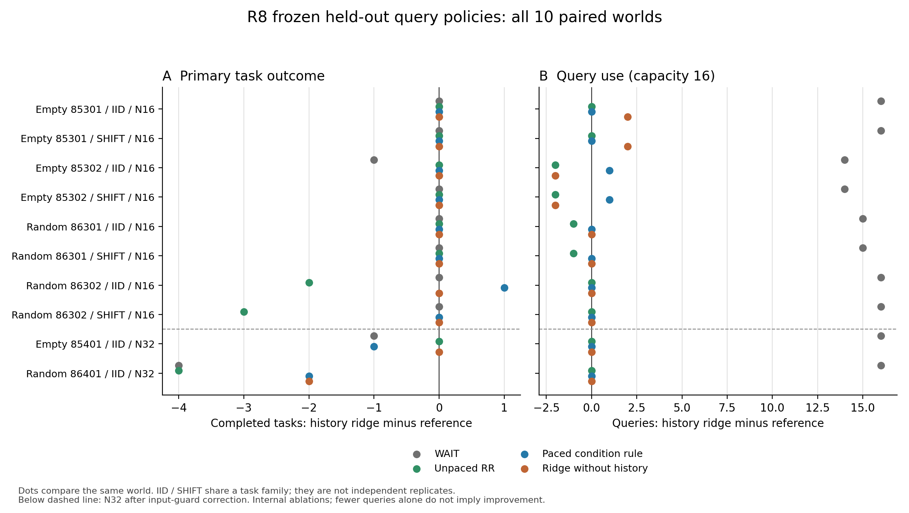

# R8完整留出配对图

数据来自root逐事件重算的`ROOT_COMPLETE_AUDIT.json`，包含60个完成臂、10个world。N32原12臂因输入上限拒绝，完整保留在`ROOT_HELDOUT_AUDIT.json`；图中N32使用只修复输入上限的事后兼容后继，未改场景或模型。每行分别比较有历史ridge与WAIT、普通RR、相同分时预算条件规则、无历史ridge；横轴为有历史模型减对照。左图正值表示完成更多任务，右图表示多用或少用查询，二者不可互相替代。同地图/任务种子的IID与SHIFT属于同family；虚线下为N32冻结迁移，不与N16合并估计总体效应。这些策略属于内部机制消融，图中没有声称击败外部发表算法。

由`plot_heldout_results.py`生成可编辑SVG、PDF及PNG，未筛选有利world。
